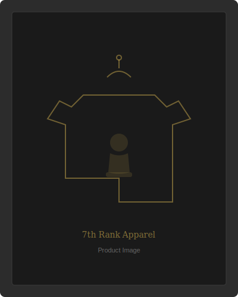

# 7th Rank — Developer Setup & Deployment Guide

## Overview

This guide covers how to set up the 7th Rank chess apparel website for local development, integrate with Shopify for e-commerce, and deploy to production environments including WordPress and static hosting.

---

## 1. Local Development Setup

### Prerequisites

- A modern web browser (Chrome 90+, Firefox 90+, Safari 15+, Edge 90+)
- A code editor (VS Code recommended)
- Git (for version control)
- Node.js 18+ (optional, for local server)

### Project Structure

```
website/
├── index.html              # Main landing page (chess board layout)
├── css/
│   └── style.css           # Main stylesheet + animations
├── js/
│   └── main.js             # Core interactivity
├── images/
│   ├── logo.svg            # Brand logo
│   └── placeholder-product.svg  # Product placeholder
└── pages/
    ├── collections.html    # Collections/shop page
    └── about.html          # About/brand story page
```

### Quick Start

1. **Clone the repository:**
   ```bash
   git clone https://github.com/your-org/7th-rank-website.git
   cd 7th-rank-website/website
   ```

2. **Open directly in browser:**
   Simply open `index.html` in your browser. All paths are relative, so the site works without a server.

3. **Or use a local server (recommended for development):**

   **Using VS Code Live Server:**
   - Install the "Live Server" extension in VS Code
   - Right-click `index.html` → "Open with Live Server"
   - The site opens at `http://127.0.0.1:5500`

   **Using Python:**
   ```bash
   cd website
   python3 -m http.server 8000
   # Open http://localhost:8000
   ```

   **Using Node.js:**
   ```bash
   npx serve website
   # Open the URL shown in terminal
   ```

### VS Code Recommended Extensions

- **Live Server** — Local development server with auto-reload
- **HTML CSS Support** — CSS class name completion in HTML
- **CSS Peek** — Peek at CSS definitions from HTML
- **ESLint** — JavaScript linting
- **Prettier** — Code formatting

---

## 2. Customization Guide

### Replacing Placeholder Images

Product images use SVG placeholders. To replace with real product photography:

1. Export images from Figma or your design tool:
   - Format: WebP (primary) with JPEG fallback
   - Resolution: 800×1000px (2x for retina: 1600×2000px)
   - Quality: 80-85% compression

2. Place images in `website/images/products/`:
   ```
   images/products/
   ├── kings-gambit-hoodie.webp
   ├── promotion-hoodie.webp
   ├── queens-gambit-tee.webp
   └── ...
   ```

3. Update `` tags in HTML files:
   ```html
   <!-- Before -->
   
   
   <!-- After -->
   
   ```

### Updating Colors

All colors are defined as CSS custom properties in `css/style.css`:

```css
:root {
  --color-black: #1a1a1a;
  --color-white: #f5f5f0;
  --color-gold: #C9A84C;
  --color-deep-green: #2d5a3d;
  /* ... */
}
```

Change any color value in `:root` and it propagates throughout the site.

### Adding New Products

1. Add a new `<article class="product-card">` in `pages/collections.html`
2. Update the JSON-LD ItemList schema in the `<head>`
3. Add the product image to `images/products/`

---

## 3. Shopify Buy Button Integration

### Setup Steps

1. **Create a Shopify account** at [shopify.com](https://www.shopify.com) (Starter plan or higher)

2. **Add the Buy Button sales channel:**
   - Go to Shopify Admin → Settings → Apps and sales channels
   - Add the "Buy Button" channel

3. **Create Buy Buttons for each product:**
   - Go to Buy Button channel → Create a Buy Button
   - Select the product
   - Customize appearance to match 7th Rank theme:
     - Button color: `#C9A84C` (gold)
     - Button text: "Add to Cart"
     - Font: Match site fonts

4. **Embed the generated code:**

   In `index.html` and `pages/collections.html`, find the Shopify placeholder comments and replace them:

   ```html
   <!-- Replace this comment block: -->
   <!-- Shopify Buy Button placeholder:
   <div id="product-component-kings-gambit-hoodie"></div>
   -->
   
   <!-- With the actual Shopify embed code: -->
   <div id="product-component-kings-gambit-hoodie"></div>
   <script type="text/javascript">
   (function () {
     var scriptURL = 'https://sdks.shopifycdn.com/buy-button/latest/buy-button-storefront.min.js';
     if (window.ShopifyBuy) {
       if (window.ShopifyBuy.UI) { ShopifyBuyInit(); }
       else { loadScript(); }
     } else { loadScript(); }
     function loadScript() {
       var script = document.createElement('script');
       script.async = true;
       script.src = scriptURL;
       (document.getElementsByTagName('head')[0] || document.getElementsByTagName('body')[0]).appendChild(script);
       script.onload = ShopifyBuyInit;
     }
     function ShopifyBuyInit() {
       var client = ShopifyBuy.buildClient({
         domain: 'YOUR-STORE.myshopify.com',
         storefrontAccessToken: 'YOUR-TOKEN',
       });
       ShopifyBuy.UI.onReady(client).then(function (ui) {
         ui.createComponent('product', {
           id: 'YOUR-PRODUCT-ID',
           node: document.getElementById('product-component-kings-gambit-hoodie'),
           moneyFormat: '%24%7B%7Bamount%7D%7D',
           options: {
             product: {
               buttonDestination: 'cart',
               contents: { img: false, title: false, price: false },
               text: { button: 'Add to Cart' },
               styles: {
                 button: {
                   'background-color': '#C9A84C',
                   'color': '#000000',
                   'font-family': '"Bebas Neue", sans-serif',
                   'letter-spacing': '0.1em'
                 }
               }
             },
             cart: {
               styles: {
                 button: { 'background-color': '#C9A84C' }
               },
               text: { total: 'Subtotal', button: 'Checkout' }
             }
           }
         });
       });
     }
   })();
   </script>
   ```

5. **Replace placeholder values:**
   - `YOUR-STORE.myshopify.com` → Your Shopify store domain
   - `YOUR-TOKEN` → Your Storefront Access Token
   - `YOUR-PRODUCT-ID` → The Shopify product ID

---

## 4. WordPress Deployment

### Method: Custom WordPress Theme

1. **Create theme directory:**
   ```bash
   mkdir -p wp-content/themes/7th-rank
   ```

2. **Create required theme files:**

   **`style.css`** (theme header):
   ```css
   /*
   Theme Name: 7th Rank
   Description: Chess-inspired streetwear brand theme
   Version: 1.0
   Author: 7th Rank
   */
   ```

   **`functions.php`** (enqueue assets):
   ```php
   <?php
   function seventh_rank_enqueue() {
       wp_enqueue_style('seventh-rank-style', get_template_directory_uri() . '/css/style.css');
       wp_enqueue_script('seventh-rank-main', get_template_directory_uri() . '/js/main.js', array(), '1.0', true);
   }
   add_action('wp_enqueue_scripts', 'seventh_rank_enqueue');
   ```

   **`index.php`** (main template):
   ```php
   <?php get_header(); ?>
   <!-- Main chess board content -->
   <?php get_footer(); ?>
   ```

3. **Split HTML into template parts:**
   - `header.php` — `<!DOCTYPE html>` through `</header>`
   - `footer.php` — Footer section through `</html>`
   - `page-home.php` — Homepage chess board layout
   - `page-collections.php` — Collections page
   - `page-about.php` — About page

4. **Copy assets:**
   ```bash
   cp -r website/css wp-content/themes/7th-rank/
   cp -r website/js wp-content/themes/7th-rank/
   cp -r website/images wp-content/themes/7th-rank/
   ```

5. **Activate the theme** in WordPress Admin → Appearance → Themes

### Recommended WordPress Plugins

- **Yoast SEO** or **Rank Math** — SEO management
- **WP Super Cache** or **W3 Total Cache** — Performance caching
- **Wordfence** — Security
- **UpdraftPlus** — Backups

---

## 5. Static Hosting Deployment

### Netlify

1. Push the `website/` directory to a Git repository
2. Connect the repository to Netlify
3. Set build settings:
   - Base directory: `website`
   - Build command: (none — static site)
   - Publish directory: `website`
4. Deploy

### Vercel

1. Install Vercel CLI: `npm i -g vercel`
2. Run from the website directory:
   ```bash
   cd website
   vercel
   ```
3. Follow the prompts

### GitHub Pages

1. Push the repository to GitHub
2. Go to Settings → Pages
3. Set source to the branch containing `website/`
4. Set the folder to `/website` (or root if website files are at root)

---

## 6. Performance Optimization Checklist

Before deploying to production:

- [ ] Replace SVG placeholders with optimized WebP product images
- [ ] Add `<link rel="preload">` for critical fonts
- [ ] Minify CSS (`style.css`)
- [ ] Minify JavaScript (`main.js`)
- [ ] Enable gzip/brotli compression on the server
- [ ] Set cache headers for static assets (images, CSS, JS)
- [ ] Test with Google PageSpeed Insights (target: 90+ on all categories)
- [ ] Test with Google Rich Results Test for structured data validation
- [ ] Verify Open Graph tags with Facebook Sharing Debugger
- [ ] Test responsive layout on real devices (iOS Safari, Android Chrome)
- [ ] Verify all internal links work correctly
- [ ] Check accessibility with axe DevTools or Lighthouse

---

## 7. Browser Support

| Browser | Minimum Version | Notes |
|---|---|---|
| Chrome | 90+ | Full support |
| Firefox | 90+ | Full support |
| Safari | 15+ | scroll-snap support |
| Edge | 90+ | Chromium-based, full support |
| iOS Safari | 15+ | Touch-optimized |
| Chrome Android | Latest | Full support |

---

## 8. Core Web Vitals Targets

| Metric | Target | Strategy |
|---|---|---|
| LCP | < 2.5s | Optimize hero images, preload fonts |
| CLS | < 0.1 | Explicit image dimensions, reserved space |
| INP | < 200ms | Minimal JS, passive event listeners |
| TTFB | < 200ms | CDN, static hosting, server caching |

---

## 9. Troubleshooting

### Common Issues and Solutions

#### Scroll-Snap Not Working

**Symptom**: Page scrolls freely instead of snapping to each rank section.

**Possible causes and fixes**:

1. **Browser zoom is not 100%**: Scroll-snap can behave unexpectedly at non-default zoom levels. Reset browser zoom to 100% (`Ctrl+0` / `Cmd+0`).

2. **Overflow property conflict**: The scroll-snap container (`main` element) requires `overflow-y: scroll` and `scroll-snap-type: y mandatory`. Check that no parent element has `overflow: hidden` that might interfere.
   ```css
   /* Verify in css/style.css */
   main {
     scroll-snap-type: y mandatory;
     overflow-y: scroll;
     height: 100vh;
   }
   ```

3. **Section height mismatch**: Each rank section must be exactly `100vh`. If content overflows, scroll-snap may break. Check for content that pushes sections beyond viewport height on smaller screens.

#### Mobile Menu Not Opening/Closing

**Symptom**: Hamburger icon doesn't toggle the mobile navigation.

**Fixes**:

1. **JavaScript not loaded**: Check the browser console (`F12` → Console) for errors. Ensure `js/main.js` is linked correctly in the HTML:
   ```html
   <script src="js/main.js" defer></script>
   ```

2. **CSS class mismatch**: The JavaScript in `main.js` toggles a `.nav-open` class on the `<body>` element. Verify the CSS in `style.css` includes styles for `.nav-open .mobile-nav` or the equivalent selector.

3. **Z-index stacking**: The mobile menu overlay needs a high z-index. Check that `z-index` values in `style.css` don't conflict with other positioned elements.

#### Images Not Displaying

**Symptom**: Broken image icons appear instead of product images or logos.

**Fixes**:

1. **Relative path issues**: When opening `index.html` directly (file:// protocol), relative paths work from the file's location. When using a local server, paths are relative to the server root.
   ```html
   <!-- From index.html (root level) -->
   
   
   <!-- From pages/collections.html (one level deep) -->
   
   ```

2. **Case sensitivity**: Linux servers are case-sensitive. Ensure file names match exactly (e.g., `logo.svg` vs `Logo.svg`).

3. **Missing files**: Verify all image files exist in `website/images/`:
   ```bash
   ls -la website/images/
   ```

#### Fonts Not Loading (FOUT/FOIT)

**Symptom**: Text appears in a fallback font, or text is invisible briefly on load.

**Fixes**:

1. **Google Fonts connection**: The site loads fonts from Google Fonts CDN. If you're working offline or behind a firewall, fonts won't load. For offline development, download the fonts and serve them locally:
   ```css
   /* Replace Google Fonts @import with local @font-face */
   @font-face {
     font-family: 'Bebas Neue';
     src: url('../fonts/BebasNeue-Regular.woff2') format('woff2');
     font-display: swap;
   }
   ```

2. **Preconnect missing**: Ensure the HTML `<head>` includes preconnect hints:
   ```html
   <link rel="preconnect" href="https://fonts.googleapis.com">
   <link rel="preconnect" href="https://fonts.gstatic.com" crossorigin>
   ```

#### Intersection Observer Animations Not Triggering

**Symptom**: Elements don't animate in when scrolling into view; they remain invisible or in their initial state.

**Fixes**:

1. **CSS initial state missing**: Elements observed by Intersection Observer start with `opacity: 0` and `transform: translateY(20px)` (or similar). The `.visible` class removes these. Check that both states exist in `style.css`.

2. **Threshold too high**: The observer in `main.js` uses a threshold value (e.g., `0.1` means 10% visible). If sections are very tall, a higher threshold might prevent triggering. Check the threshold in `main.js`:
   ```javascript
   const observer = new IntersectionObserver(callback, {
     threshold: 0.1  // Triggers when 10% of element is visible
   });
   ```

3. **JavaScript disabled**: If the browser has JavaScript disabled, elements will remain in their CSS initial state. Add a `<noscript>` fallback or use CSS-only defaults:
   ```css
   /* Fallback: show elements if JS doesn't add .visible */
   @media (prefers-reduced-motion: reduce) {
     .animate-on-scroll {
       opacity: 1;
       transform: none;
     }
   }
   ```

#### Shopify Buy Button Not Appearing

**Symptom**: The "Add to Cart" button area is empty after adding Shopify embed code.

**Fixes**:

1. **Incorrect credentials**: Verify your Shopify store domain and Storefront Access Token are correct in the embed code. The domain should be `your-store.myshopify.com` (not the custom domain).

2. **Product ID mismatch**: Each Buy Button needs the correct Shopify product ID. Find it in Shopify Admin → Products → click product → the ID is in the URL.

3. **Content Security Policy**: If hosting on a platform with strict CSP headers, you may need to allow `https://sdks.shopifycdn.com` and `https://*.myshopify.com` in your CSP configuration.

4. **Multiple Buy Button scripts**: If you have multiple products, ensure the Shopify SDK script is only loaded once. Subsequent products should reuse the existing `ShopifyBuy` global.

#### WordPress Theme Not Displaying Correctly

**Symptom**: Styles are broken or missing after converting to a WordPress theme.

**Fixes**:

1. **Asset paths**: WordPress uses `get_template_directory_uri()` for asset URLs. Ensure all CSS and JS enqueue calls use this function:
   ```php
   wp_enqueue_style('seventh-rank-style', get_template_directory_uri() . '/css/style.css');
   ```

2. **wp_head() and wp_footer()**: WordPress requires `<?php wp_head(); ?>` before `</head>` and `<?php wp_footer(); ?>` before `</body>`. Missing these will prevent enqueued assets from loading.

3. **Conflicting styles**: WordPress admin bar and theme defaults may conflict. Add to your CSS:
   ```css
   /* Account for WordPress admin bar */
   body.admin-bar main {
     height: calc(100vh - 32px);
   }
   ```

#### Live Server Hot Reload Not Working

**Symptom**: Changes to HTML/CSS/JS files don't auto-refresh in the browser.

**Fixes**:

1. **Wrong root folder**: Ensure VS Code has the `website/` folder (or its parent) open as the workspace root. Live Server serves from the workspace root.

2. **File save**: Ensure the file is actually saved (`Ctrl+S` / `Cmd+S`). VS Code's auto-save can be enabled in Settings → Files: Auto Save → `afterDelay`.

3. **Browser cache**: Hard-refresh with `Ctrl+Shift+R` / `Cmd+Shift+R` to bypass cache. Alternatively, open DevTools → Network tab → check "Disable cache."

---

## 10. Getting Help

- **Project documentation**: See `./docs/strategy_and_research.md` for design rationale and `./docs/github_setup.md` for repository workflow
- **Research files**: Detailed technical research in `./research/design_strategy.md`, `./research/seo_strategy.md`, and `./research/jesko_jets_analysis.md`
- **Browser DevTools**: Use the Elements panel to inspect CSS, Console for JS errors, Network for loading issues, and Lighthouse for performance audits
